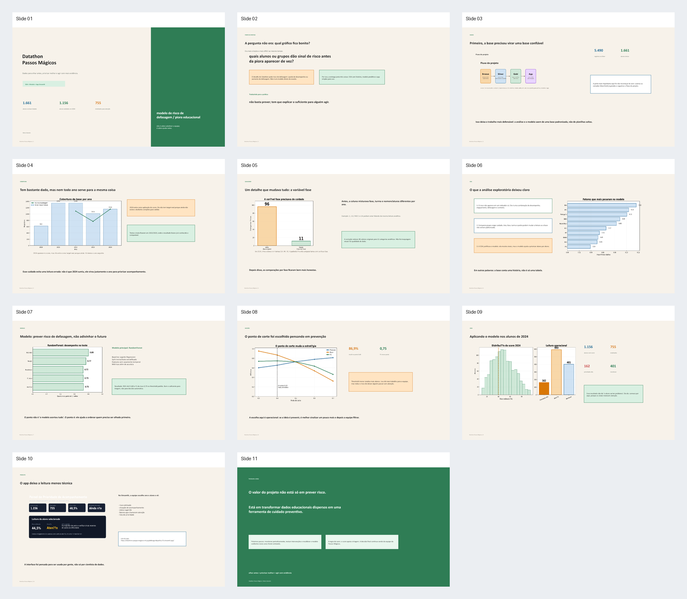

# Datathon Passos Mágicos ML

Projeto desenvolvido para o Datathon Passos Mágicos, com foco em transformar dados educacionais históricos em uma ferramenta de apoio à decisão preventiva.

A entrega combina engenharia de dados, análise exploratória, modelagem de risco e um app em Streamlit para consulta de score por aluno.

## Entregas principais

- Pipeline de dados em camadas `Bronze -> Silver -> Gold`.
- Notebook de EDA com storytelling executivo.
- Notebook de modelagem de risco educacional.
- App Streamlit para consulta de score e fatores associados.
- Apresentação final com roteiro para vídeo.

## App publicado

O app está disponível em:

[https://datathon-paapps-magicos-ml-jcpp4d6sagrv8qxwfscu73.streamlit.app/](https://datathon-paapps-magicos-ml-jcpp4d6sagrv8qxwfscu73.streamlit.app/)

## Apresentação final

- [Apresentação em PowerPoint](./datathon_passos/apresentacao/datathon_passos_apresentacao.pptx)
- [Roteiro para vídeo de até 5 minutos](./datathon_passos/apresentacao/roteiro_apresentacao.md)
- [Prévia visual dos slides](./datathon_passos/apresentacao/preview/montage.png)



## Estrutura do projeto

```text
datathon_passos/
├── app/
│   └── streamlit_app.py
├── apresentacao/
│   ├── datathon_passos_apresentacao.pptx
│   ├── roteiro_apresentacao.md
│   └── preview/
├── data/
│   ├── silver/
│   └── gold/
├── notebooks/
│   ├── 01_ingestao_padronizacao.ipynb
│   ├── 02_eda_storytelling.ipynb
│   └── 03_modelagem_risco.ipynb
├── src/
│   ├── features/
│   └── pipeline/
└── README.md
```

## Como rodar localmente

```powershell
cd C:\Users\00157NLUC-BrenoR\Datathon
.\.venv\Scripts\Activate.ps1
streamlit run .\datathon_passos\app\streamlit_app.py
```

Para instalar dependências em um ambiente novo:

```powershell
cd C:\Users\00157NLUC-BrenoR\Datathon\datathon_passos
python -m pip install --upgrade pip
python -m pip install -r requirements.txt
```

## Resumo metodológico

O projeto segue o fluxo:

1. Consolidação e padronização das bases.
2. Criação das bases Silver e Gold.
3. Análise exploratória com foco em evidência para decisão.
4. Construção de um target de risco de defasagem/piora educacional.
5. Treino e avaliação de modelos preditivos.
6. Aplicação do score nos alunos de 2024.
7. Consumo do resultado no app Streamlit.

O score não deve ser interpretado como decisão automática. Ele funciona como ferramenta de triagem para ajudar a equipe a priorizar quais alunos precisam de acompanhamento preventivo.

## Documentação detalhada

A documentação completa do projeto está em:

[datathon_passos/README.md](./datathon_passos/README.md)
